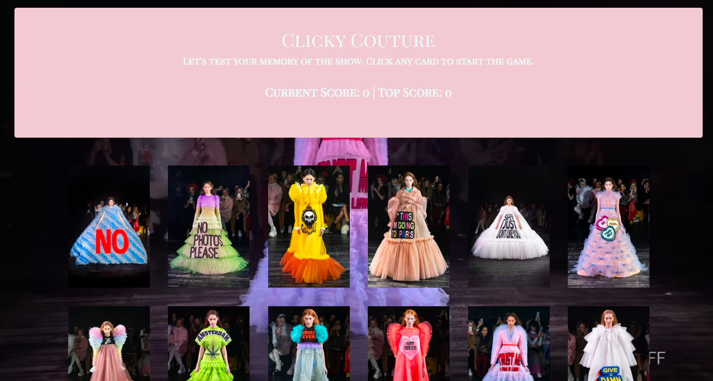

# Clicky Couture :sparkles:

Fashion house Viktor & Rolf released their 2019 Couture Collection making a statement. Literally... Play this Couture Clicky game to test your memory of the runway show! Click one card at a time, and try not to click the same one twice! Get through all 12 to win the game. 



## Getting Started

Play this game [here](https://melikalbasi.github.io/clicky-couture/), or alternatively, you can clone down this repo and play locally.

### Prerequisites

You will need [yarn](https://yarnpkg.com/en/) and [node](https://nodejs.org/en/) to run this app.

### Installing

After you've cloned down this repo, navigate to the root in your terminal and run this command to install all dependencies

```
yarn install
```

then run

```
yarn start
```
to initialize the app at localhost:3000


## How To Play

Simply click any runway image card to start the game. As you click each new card, your score will go up. Beat the game by clicking every unique card and be sure not to click the same card twice or you'll lose the game!


## Built With

* HTML5 & CSS3
* [JavaScript](https://www.javascript.com/) - Programming Language
* [React.js](https://reactjs.org/) - Frontend Javascript Library
* [Node.js](https://nodejs.org/en/) - JavaScript runtime
* [Bootstrap](https://getbootstrap.com/) - CSS framework

## NPM Package used

* [react-youtube](https://www.npmjs.com/package/react-youtube)

## Authors

* **Melika Kalbasi** - *Initial work* - [melikalbasi](https://github.com/melikalbasi)


## License

This project is licensed under the MIT License - see the [LICENSE.md](LICENSE.md) file for details

